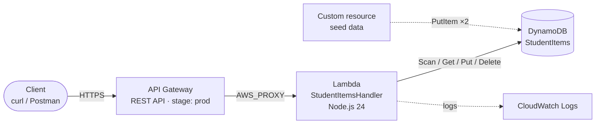

# Serverless CRUD API with AWS CDK


A fully serverless REST API, defined as **Infrastructure as Code** with the AWS CDK (TypeScript). It exposes create, read, update and delete operations on a DynamoDB table through API Gateway and a single Lambda function.

The whole stack is built with **L1 (`Cfn*`) constructs**, which map one-to-one to CloudFormation resources. This makes every IAM permission, integration and deployment step explicit.

## Architecture



| Component | Resource | Details |
|---|---|---|
| Database | `AWS::DynamoDB::Table` | `StudentItems`, partition key `id`, on-demand billing |
| Seed data | `Custom::AWS` | Inserts items `1001` and `1002` at deploy time |
| Compute | `AWS::Lambda::Function` | `StudentItemsHandler`, AWS SDK v3, 256 MB, 10 s timeout |
| Permissions | `AWS::IAM::Role` + `Policy` | Least privilege: access to this table and this function's logs only |
| API | `AWS::ApiGateway::RestApi` | Regional REST API with Lambda proxy integration |
| Deployment | `Deployment` + `Stage` | Published to the `prod` stage; the URL is printed after deploy |

## API endpoints

| Method | Path | Description | Success | Errors |
|---|---|---|---|---|
| `GET` | `/items` | List all items | `200` | |
| `POST` | `/items` | Create an item (`id` and `name` required) | `201` | `400` invalid input · `409` id already exists |
| `GET` | `/items/{id}` | Get one item | `200` | `404` not found |
| `PUT` | `/items/{id}` | Create or replace an item (`name` required) | `200` | `400` invalid input |
| `DELETE` | `/items/{id}` | Delete an item | `200` | |

Item format:

```json
{ "id": "1001", "name": "AWS CDK", "description": "Infrastructure as Code", "category": "Cloud" }
```

## Getting started

### Prerequisites

- Node.js 20 or later
- AWS CLI configured with credentials (`aws configure`)
- CDK bootstrapped once in your account/Region: `npx cdk bootstrap`

### Deploy

```bash
npm ci
npm test            # run the unit tests
npx cdk deploy      # deploy to your AWS account (default Region: ca-central-1)
```

When the deployment finishes, CDK prints the API URL:

```
Outputs:
ServerlessCdkProjectStack.ApiUrl = https://abc123.execute-api.ca-central-1.amazonaws.com/prod/
```

### Try it

```bash
API=https://abc123.execute-api.ca-central-1.amazonaws.com/prod

# List items (returns the 2 seed items)
curl $API/items

# Create
curl -X POST $API/items -H "Content-Type: application/json" \
  -d '{"id":"1003","name":"Amazon S3","description":"Object Storage","category":"Storage"}'

# Read one
curl $API/items/1003

# Update
curl -X PUT $API/items/1003 -H "Content-Type: application/json" \
  -d '{"name":"Amazon S3","description":"Scalable object storage","category":"Storage"}'

# Delete
curl -X DELETE $API/items/1003
```

### Clean up

```bash
npx cdk destroy
```

The table uses `RemovalPolicy.DESTROY`, so all resources (including the data) are deleted.

## Testing

```bash
npm test
```

18 unit tests run without an AWS account:

- **Infrastructure tests** (`test/serverless-cdk-project.test.ts`) use CDK assertions to check the synthesized template: table configuration, runtime, least-privilege IAM, scoped Lambda permission, the five routes, the stage and the outputs.
- **Lambda tests** (`test/lambda-handler.test.ts`) call the handler with a mocked DynamoDB client to check every route and status code (200, 201, 400, 404, 405, 409).

GitHub Actions runs type-checking, the tests and `cdk synth` on every push.

## Project structure

```
.
├── bin/serverless-cdk-project.ts       # CDK app entry point
├── lib/serverless-cdk-project-stack.ts # Stack: DynamoDB, IAM, Lambda, API Gateway
├── lambda/index.js                     # Lambda handler (CRUD routing)
├── test/                               # Infrastructure + Lambda unit tests
└── .github/workflows/ci.yml            # CI pipeline
```

## Design decisions

- **Least privilege IAM.** The Lambda policy is limited to the `StudentItems` table ARN and the function's own log group, instead of `Resource: "*"`. The invoke permission is limited to this API through `SourceArn`.
- **Safe creates.** `POST` uses a DynamoDB condition (`attribute_not_exists(id)`) so it can never overwrite an existing item. Updates go through `PUT`.
- **No hard-coded account.** The account and Region come from the AWS CLI profile (`CDK_DEFAULT_ACCOUNT` / `CDK_DEFAULT_REGION`).
- **Explicit deployment order.** The API deployment depends on all five methods, and the Lambda function depends on its IAM policy, which avoids race conditions during the first deploy.

## Skills demonstrated

AWS CDK (TypeScript) · CloudFormation · API Gateway · AWS Lambda · DynamoDB · IAM least privilege · REST API design · Unit testing (Jest) · CI/CD with GitHub Actions
